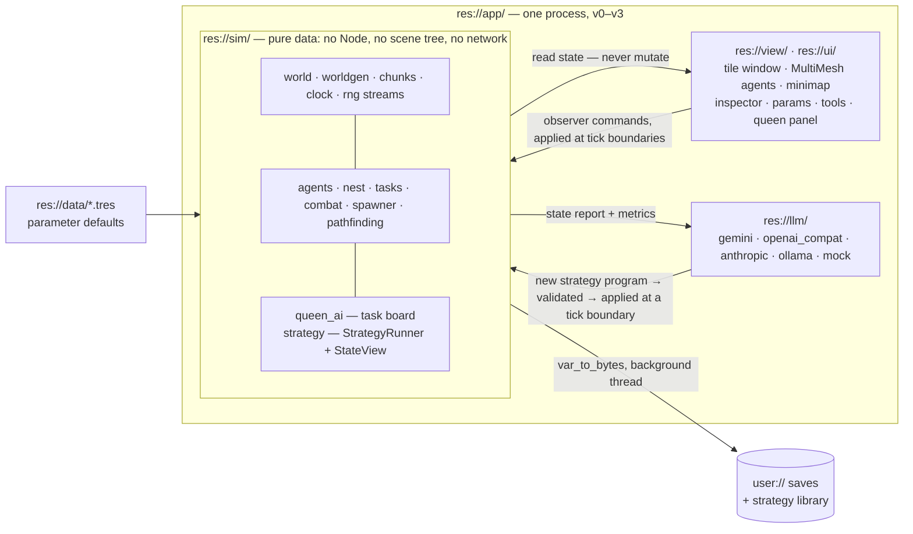
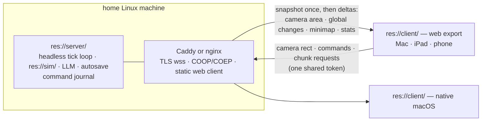
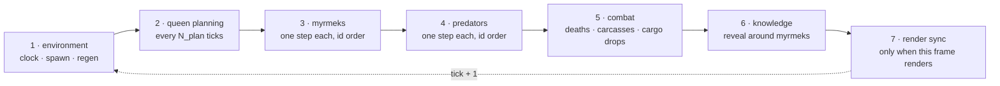
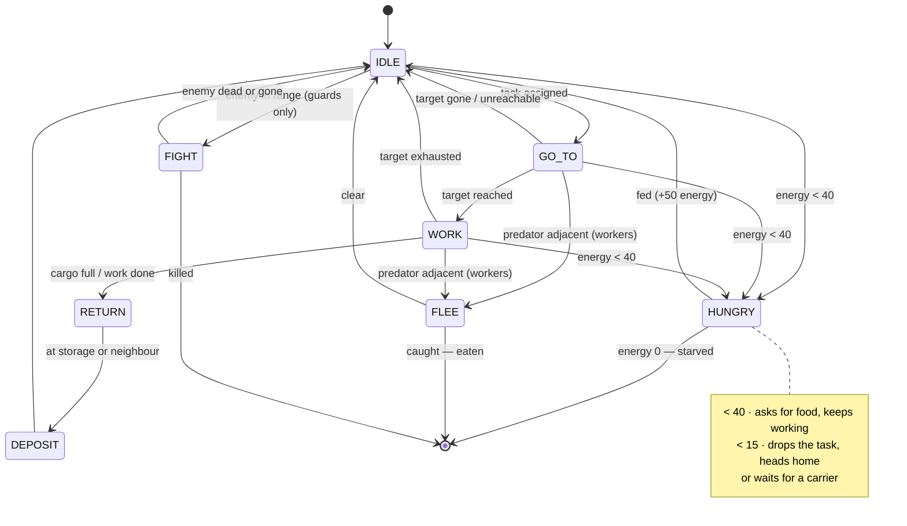
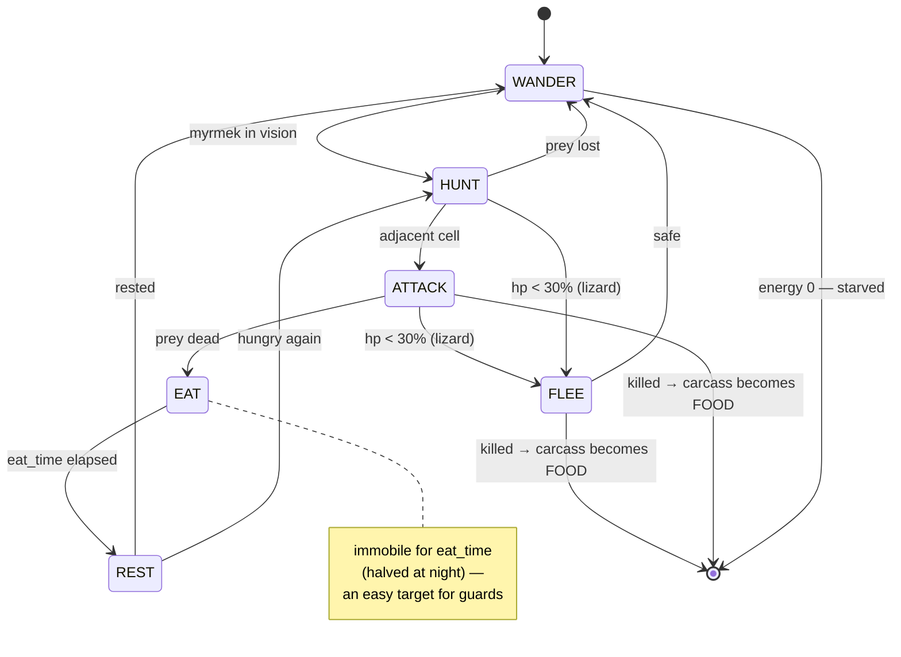
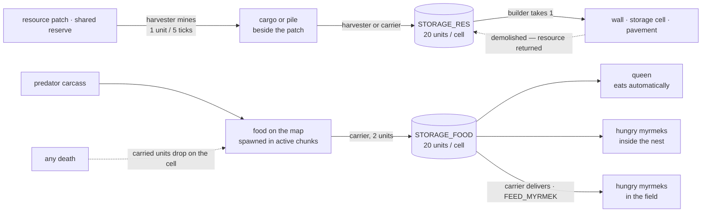
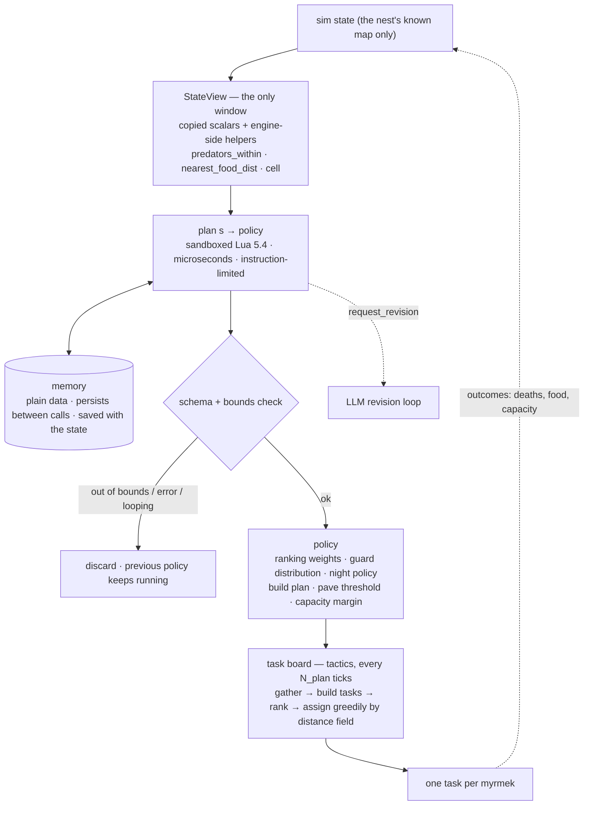
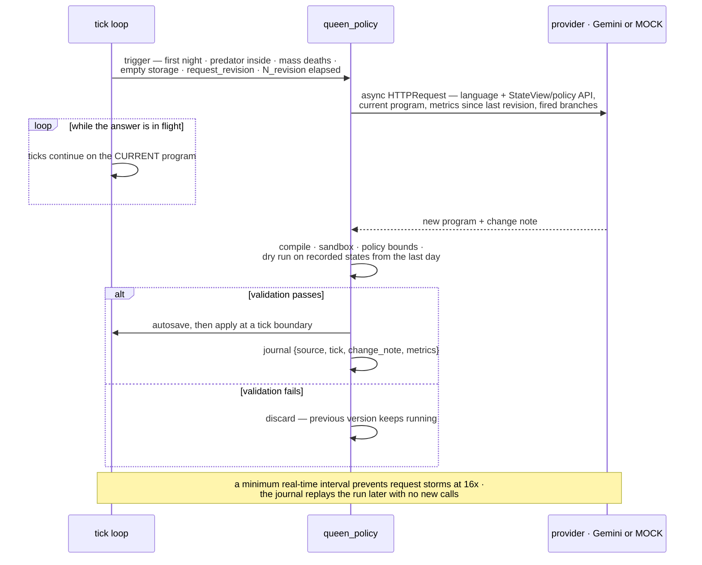

# Architecture — Myrmex

Document version 1.5 — 27 September 2026.

## Overview

Two layers bound by one rule: the **simulation is pure data** — arrays and dictionaries with no dependency on Godot's scene tree — and everything else (rendering, UI, later the network) only reads it or feeds commands into it at tick boundaries. Capabilities grow by version (three roles → six, one predator → three, a tiny `StateView` → the full one, single app → server and clients), but the sim/presentation split, the determinism rules, and the contracts below are fixed from the first line of code. That is what makes headless tests, the strategy arena, saves-as-serialization, and the v4 server split cheap instead of rewrites.



From v4 the same `res://sim/` runs headless on a server and the observer becomes a thin client; nothing in the simulation changes:



## What v0 implements

Everything below describes the full v1 system. The **v0 prototype** ([ROADMAP.md §v0](ROADMAP.md)) builds a reduced version of exactly this architecture — **not a separate codebase and not a throwaway**: v1 widens v0's scope without rewriting its structure. Read the table as "which parts of the sections that follow exist in the first build".

**Reduced in v0 (scope), per section:**

| Section | In v0 | Deferred |
|---|---|---|
| **World model** | 256x256 fixed, all layers present, objects/agents sparse | Sizes to 2048², 64x64 chunks, the active zone (v1.1) — in v0 the whole world is awake |
| **Time and the tick** | The full seven-phase order, 10 ticks/s, day–dusk–night–dawn with predator night multipliers, `seal_at_night` | Nothing |
| **Agents — roles** | Three: **worker** (scout + carrier + harvester in one: carries if there is cargo, mines if a patch is assigned, else takes the frontier), **builder**, **guard**; 40 myrmeks + the queen (22/8/10) | Six specialized roles, ~100 myrmeks, cargo handover between neighbours (v1.2) |
| **Agents — energy** | Full model: fixed-point energy, hunger thresholds, starvation deaths, cargo drop on death | Nothing |
| **Agents — predators** | The spider only, with its night multipliers and full state machine | Beetle, lizard, per-species target counts (v1.3) |
| **Combat** | Full: 8-adjacent damage, stacking attackers, gap crossfire, carcasses as food | Nothing |
| **Nest — knowledge** | Full: per-nest `known` mask, incremental frontier, unknown cells excluded from paths and tasks | Nothing |
| **Nest — structure** | Walls, storages, gaps, computed interior/capacity, demolition with resource return, night sealing; the build plan is **fixed rings that grow with population** | Traffic-driven planning, `PAVEMENT` and roads (v1.4) |
| **Queen — tactical** | The task board with `EXPLORE`, `FETCH_FOOD`, `HARVEST`, `BUILD`, `FEED_MYRMEK`, `PATROL`, `HOLD_GAP`, `OPEN_GAP`, `CLOSE_GAP`; ranking, greedy assignment, the first-day plan | `FETCH_PILE`, `DELIVER_RES`, `INTERCEPT`, `PAVE`, `ESCORT`, `GUARD_SITE`; defence-strategy weights (v1.3) |
| **Queen — strategic** | `StrategyRunner` with the **sandboxed Lua 5.4 runner** (sandbox, instruction limit, dry run), a **tiny `StateView`** (~10 scalars) and **6 policy fields**, version validation and journal, `PROGRAM` + `LLM` modes | The full `StateView` and policy schema, the strategy library and arena (v1.5) |
| **LLM** | Gemini 3.1 Pro + `MOCK`; writes the program at start, revises after the first night and on "more than three deaths since dawn" | OpenAI-compatible, Anthropic, Ollama providers (v1.5) |
| **Pathfinding** | Weighted BFS distance field + local `AStarGrid2D`, recomputed **globally over the whole 256² world** | Incremental recomputation scoped to chunks (v1.1) |
| **Saves** | Serialization of the full state; **one autosave file**, written at dawn and on exit; launch resumes from it | Rotation (3 + one per day), the saved-days list, named slots (v1.6) |
| **Rendering** | SVG sprites, tile window, `MultiMeshInstance2D` myrmeks with interpolation, `CanvasModulate` day/night; **flat tiles, two zooms (16/32 px)** | Terrain-set autotiling, zooms 8–48, `PointLight2D` at the gap (v1.6) |
| **UI** | Camera, pause + 1x/4x/16x + step, minimap, click inspector, statistics, event log, queen panel; **two interventions** (place food, release a spider); parameters edited in `.tres` | The live parameters panel, the full inspector, all interventions (v1.6) |
| **Server / Net** | Not present — one process, `res://app/` | The whole of v4 |

**Not reduced in v0 (invariants).** The prototype cuts features, never the rules that make later versions cheap — each of these is load-bearing from the first commit:

- The simulation is **pure data** in `res://sim/`, with no `Node`, scene-tree or network dependency; view and UI only read it, and observer commands enter at tick boundaries.
- **Determinism end to end**: one master seed, named RNG streams, integer-only sim arithmetic, agents stepped in id order, the fixed seven-phase tick, journaled LLM answers.
- **Physical rules**: one agent per cell everywhere, 8-directional movement with Chebyshev radii, walls impassable to all, a gap as a plain ground cell, interior computed by flood fill, demolition returning its resource.
- **Contracts**: `StateView`, the policy schema, `StrategyRunner`, the task shape, the provider interface and the save format are all pinned by contract tests in v0 — they *grow* additively in v1 rather than changing shape.
- **The strategy sandbox**: Lua from v0.5, because the prototype is precisely where model-written code first runs inside the process.
- **Headless first**: `res://sim/` runs and is tested with no rendering (v0.1 ships before any view exists).

Estimated size of the whole prototype: three to four thousand lines of GDScript.

## Components

- **World** (`world.gd`). Layer arrays per cell, chunk bookkeeping, cell access. See §World model.
- **Worldgen** (`worldgen.gd`). Deterministic generation from a seed: noise terrain, smoothing, start guarantees.
- **Clock** (`clock.gd`). Ticks, speed multipliers, day phases. See §Time and the tick.
- **Agents** (`agent.gd`, `myrmek.gd`, `predator.gd`). One shared record shape; per-role and per-species state machines. See §Agents.
- **Nest** (`nest.gd`). Knowledge mask, frontier, storages, structures, build plan and queue, interior/capacity.
- **Queen — tactical** (`queen_ai.gd`, `tasks.gd`). The task board: gather state → build tasks → rank → assign. See §The queen's brain.
- **Queen — strategic** (`strategy.gd`, `strategy_lua.gd`, `queen_policy.gd`, `nest_report.gd`). The `StrategyRunner` seam with the sandboxed Lua 5.4 runner (godot-luaAPI, from v0.5), `StateView` assembly, policy validation, the `PROGRAM`/`LLM` modes, the strategy library, and report building for the LLM.
- **LLM providers** (`res://llm/`). Gemini 3.1 Pro (main), OpenAI-compatible, Anthropic, Ollama, and `MOCK` (reads a program from a file); the `StateView`/policy API description and prompts for the model.
- **Pathfinding** (`pathfinding.gd`). Distance field + local A*. See §Pathfinding.
- **Combat** (`combat.gd`). Adjacent-cell damage, deaths, carcasses, cargo drops.
- **Spawner** (`spawner.gd`). Food, resource regeneration, predator population — active zone only.
- **RNG** (`rng.gd`). Named seeded streams (worldgen, spawner, combat, strategy, interventions), all derived from the master seed; every random draw goes through one of them.
- **Save** (`save.gd`). Serialization, autosave, slots. See §Saves.
- **View** (`res://view/`). Tile-window renderer, MultiMesh agents, minimap, day/night modulation. Reads state, never writes it.
- **UI** (`res://ui/`). HUD, inspector, parameter panel, statistics, intervention tools, queen panel.
- **Server / Client / Net** (`res://server/`, `res://client/`, `res://net/`, v4). Headless tick loop with connected observers; snapshot-plus-deltas protocol. See ROADMAP v4.

## World model

Each cell is a stack of layers:

| Layer | Storage | Values |
|---|---|---|
| Terrain | `PackedByteArray` | `GROUND` (passable), `WATER`, `WALL` (impassable to all) |
| Structure | `PackedByteArray` | `NONE`, `NEST_WALL`, `PAVEMENT`, `STORAGE_FOOD`, `STORAGE_RES`, `QUEEN_CHAMBER` |
| Object | sparse `Dictionary[cell -> Object]` | `FOOD(units)`, `RESOURCE(patch_id)`, `PILE(type, units)` — at most one object per cell |
| Agents | sparse `Dictionary[cell -> agent_id]` | myrmeks and predators — at most one agent per cell |
| Knowledge | `PackedByteArray` per nest | 0 unknown, 1 known |

The world is divided into **64x64 chunks** (a 32x32 grid at the default 2048x2048). A chunk stores an active flag, its agent/object lists, and a changed flag for the minimap. The **active zone** — chunks within a radius of the nest plus chunks with known cells or agents — is the only place spawning and regeneration run; the rest of the map sleeps until discovered.

**Generation:** seed + size (256–2048, multiple of 64) + water/rock shares + patch count → `FastNoiseLite` terrain smoothed by a cellular automaton; the start point is the centre of the largest connected ground region, cleared to radius 12; guarantees near the start (≥2 resource patches and ~20 food within 30 cells) make the first day hard but possible. The queen's cell becomes `QUEEN_CHAMBER` at no cost; there is no starting nest.

**Dynamics:** food clusters spawn per active chunk (`T_food`/`p_food`); depleted patches regenerate after `T_res`; each predator species is kept at a target count, spawning on a 60–150 cell ring outside the nest's vision; a predator carcass becomes `FOOD`.

## Time and the tick

Discrete ticks at 10/s base speed (0.5x–16x multipliers, pause, single-step). Agent speed is `move_cooldown` — ticks between steps. The day cycle is day 600 / dusk 60 / night 400 / dawn 60 = 1120 ticks. At night predators halve their cooldown and eating time and gain +50% vision; myrmeks lose 1 vision (detection; the reveal radius is capped by current vision); the queen's night policy pulls the nest inside, posts guards at gaps, and by default seals gaps at dusk and reopens them at dawn (`seal_at_night`).

**Phase order inside every tick (invariant):**

1. Environment: clock, spawning, regeneration.
2. Queen planning — every `N_plan` ticks (default 10).
3. Myrmeks: one state-machine step each, in id order.
4. Predators: the same.
5. Combat and deaths.
6. Knowledge update (reveal around myrmeks).
7. Render sync (only when this frame renders).



## Agents

One record shape for everyone: `id`, `kind`, `type`, `nest_id`, `cell`, `hp`/`hp_max`, `energy`/`energy_max`, `move_cooldown`/`move_timer`, `vision`, `attack`, `carry` (type, units, capacity), `state`, `task_id`, `target_cell`, `path`. No age. **Movement is 8-directional with uniform cost; all radii and adjacency use Chebyshev distance** — which is why wall rings are squares.

**Roles** (default mix 15/20/15/30/20 + the queen = 101):

| Role | Key stats | Job |
|---|---|---|
| Scout | vision 5, cooldown 1, hp 3 | Opens the frontier, one angular sector each; reveals radius 5 (others reveal radius 2) |
| Guard | vision 4, cooldown 2, hp 20, attack 5 | Patrols, intercepts, holds gaps, escorts groups, guards sites |
| Builder | cooldown 2, hp 5, carries 1 | Builds walls/storages/paving (`build_time` 10), demolishes anything (`demolish_time` 5, resource returned) |
| Carrier | cooldown 1, hp 4, carries 2 | Food to storage, piles to storage, food to the hungry, resources to builders |
| Harvester | cooldown 2, hp 5, carries 3, mines 1/5 ticks | Works an assigned patch; hauls or piles the yield |
| Queen | immobile, hp 50 | Coordinator; eats from storage automatically |

**State machine (all roles):** `IDLE → GO_TO → WORK → RETURN → DEPOSIT → IDLE`, with interrupts `HUNGRY` (energy < 40: asks for food, keeps working), critical (< 15: drops the task, heads home or waits for a carrier), `FLEE` (workers near a predator), `FIGHT` (guards only), `DEAD`. Adjacent nest-mates can hand cargo over.



**Energy:** max 100; idle 0.01/tick; step 0.05 (+50% loaded; 0.03 on paving); attack 0.5; one food unit = +50; queen 0.1/tick, sated at ≥70; energy 0 = death. Energy and every other accumulated quantity are stored as **fixed-point integers** (thousandths of a unit: idle 10, step 50/75/30, attack 500, one food unit 50 000, max 100 000) — see §Determinism and replay. **On any death carried units drop on the cell as `FOOD`/`PILE` (lost if the cell already holds an object); an eaten or starved body disappears.**

**Predators** (energy-driven: hungry hunts, sated wanders, starving dies):



| Species | Behaviour | Cooldown d/n | Vision d/n | hp | Attack | Eat d/n | Carcass |
|---|---|---|---|---|---|---|---|
| Spider | Ambush near routes | 2 / 1 | 6 / 9 | 15 | 4 | 20 / 10 | 5 |
| Beetle | Slow tank, never flees | 3 / 2 | 4 / 6 | 40 | 6 | 30 / 15 | 8 |
| Lizard | Chaser; night extra step every 2nd tick; flees < 30% hp | 1 / 1+ | 8 / 12 | 25 | 5 | 15 / 6 | 6 |

**Combat:** every tick, an agent with an attack value damages an enemy in one of its 8 neighbouring cells; damage stacks across attackers; a predator in a gap is hit from both sides. A worker dies to one predator hit; guards survive several.

## Nest

- **Knowledge:** a cell seen once by any nest myrmek is known forever; known cells show live state. The **frontier** (known passable cells bordering unknown) is maintained incrementally.
```
   outside                                  #  NEST_WALL — impassable to everyone
   · · · · · · · · · · ·                    .  interior ground (this is the capacity)
   · # # # # # # # # # ·                    Q  QUEEN_CHAMBER (free, on the queen's cell)
   · # . . . . . . . # ·                    F  STORAGE_FOOD   R  STORAGE_RES (2 res each)
   · # . = = = . . . # ·                    =  PAVEMENT — cooldown ÷ pave_speed
   · # . = Q F R . . # ·                    G  guard holding the gap
   · # . = = = . . . # ·                    ⟵  the gap: a plain ground cell, no wall.
   · # . . . . . . . # ·                        Anything may pass — one agent per cell,
   · # # # # G # # # # ·                        so one guard physically blocks it.
   · · · · ·⟵· · · · · ·
```

The flood fill from `Q` spreads over the 21 `.`/`=` cells and stops at `G`, so this nest's capacity is 21 myrmeks — everyone else sleeps outside by the gap, under guard. At dusk a builder walls `G` shut (`seal_at_night`) and reopens it at dawn.

- **Interior is computed, not built:** a flood fill from the queen chamber, blocked by walls, stopping at gaps. Its passable-cell count is the nest's capacity (target: population + ~10% margin, since one agent fits per cell). When capacity or storage runs short, the queen plans a wider ring; after it closes, the old ring is dismantled and its resources return.
- **Walls and gaps:** a wall costs 1 resource and is impassable to everyone; a storage cell costs 2 and holds 20 units; a gap is an open ground cell — one guard standing in it physically blocks it. Builders may wall any ground cell and demolish any wall (seal at dusk, reopen at dawn, break out if besieged).
- **Paving and roads:** `PAVEMENT` (1 resource) divides `move_cooldown` by `pave_speed` (default 2) and cuts step energy; the nest counts decaying per-cell traffic, and cells above `pave_traffic` enter the `PAVE` queue after walls and storages — roads grow along real routes. Predators get no benefit. Paving does not define "inside".
- **Flows:**



## The queen's brain

**Tactical level — every `N_plan` ticks:** gather state (food, piles, patches, predators on the known map, hungry myrmeks, build queue, storage levels, frontier) → build the task board (`EXPLORE`, `FETCH_FOOD`, `FETCH_PILE`, `HARVEST`, `BUILD`, `FEED_MYRMEK`, `DELIVER_RES`, `PATROL`, `INTERCEPT`, `HOLD_GAP`, `OPEN_GAP`, `CLOSE_GAP`, `PAVE`, `ESCORT`, `GUARD_SITE`) → rank by policy (safety → feeding → food income → construction → resources → exploration) → assign greedily by the distance field. **Known but unreachable cells (no finite distance) are never assigned as targets.** A task whose target vanishes is cancelled. Guard distribution across patrol/gaps/escort/sites is the defence-strategy space ("fortress", "convoy", "outposts", adaptive). While no nest exists, a hardcoded first-day plan runs: harvesters to the nearest patch, builders raise a radius-5 ring (~40 walls) with one gap and a food storage, guards ring the queen, scouts open the surroundings.

**Strategic level — the strategy program:** a module with `plan(s) -> policy` and a persistent `memory` table, executed by the queen on every planning cycle (microseconds). It assigns no tasks, moves no myrmeks, and sees nothing beyond the nest's knowledge.



The strategic and tactical levels run on completely different clocks: `plan()` is microseconds every `N_plan` ticks, while the model is called rarely and never blocks a tick.

- **`StateView`** is the only window: simple values copied into a dictionary (day phase, population by role, deaths by cause, storages, queen energy, known food/patches/predators with distances, frontier size, capacity vs population, gap status) plus engine-side helpers (`predators_within(r)`, `nearest_food_dist()`, `patch_reserve(id)`, `cell(x, y)`). The `World` object is never passed.
- **Policy** comes back as a table — ranking weights, guard distribution, night policy, build plan, paving threshold, capacity margin, `request_revision`, and (from v2) the desired role mix — converted to a `Dictionary` and checked against a schema and value bounds.
- **`StrategyRunner`** hides the execution environment. From the first prototype (v0.5) the runner is **Lua 5.4 via godot-luaAPI**: a real sandbox — only `base`/`table`/`string`/`math` are bound, so `os`, `io`, `require`, `load` and the engine simply do not exist for a strategy — with an instruction-counter hook that interrupts a looping `plan()` and protected calls for errors. `memory` is plain data only (it is saved with the state). There is no GDScript runner; the seam stays so the environment could be swapped without touching the rest of the code.

**Who writes the program — `queen_brain`:**

| Mode | Author | Changes |
|---|---|---|
| `PROGRAM` | A human, or a saved library program | Never by itself; the baseline |
| `LLM` | The model writes it at start, revises by results | On events (first night, predator inside, mass deaths, empty storage), on `request_revision`, at most once per `N_revision` |
| `LEARNED` (v6) | A small NN tunes parameters / picks from the library; asks the LLM at low confidence | Every planning cycle |

**The LLM loop:** the model receives the language description, the `StateView`/policy API, the goal, and the situation → returns a program; on revision it also gets the current program, metrics since the last revision, and a log of which branches fired → returns a new version plus a change note. Every version passes validation — compile, static check or sandbox, policy bounds, a dry run on recorded states from the last day — or is discarded while the previous version keeps running. Calls are asynchronous (`HTTPRequest`); the simulation never waits; a minimum real-time interval prevents request storms at 16x. Every accepted version is journaled with its tick, so saves and replays reproduce LLM runs without new calls. **The model never controls an individual myrmek.**



**Strategy library:** programs are files (`user://strategies/`) with names, versions, and revision history; any can be loaded as `PROGRAM` or raced headless on identical seeds — the arena.

## Contracts

The stable seams. Changing a contract must change its contract test (§Testing).

- **Tick phase order** — the seven phases above, exactly.
- **`StateView`**: the scalar dictionary + helper functions; identical for GDScript, Lua, and the API description sent to the LLM. Grows additively.
- **Policy table**: field set, types, and bounds; validated before use.
- **`StrategyRunner`**: `load(source) -> ok|error`, `plan(state_view) -> policy`, persistent `memory`, execution limits.
- **Task**: `{type, target, priority, assignee}` and its lifecycle (created → assigned → done/cancelled).
- **LLM provider**: async `request_program(context) -> {program_source, change_note}`; `MOCK` serves a file.
- **Agent record** and **cell layers** as defined in §Agents / §World model.
- **Save format**: versioned JSON header + compressed `var_to_bytes` body (§Saves).
- **Strategy version record**: `{id, source, author_mode, tick, change_note, metrics}` — the journal replays runs without re-calling the model.

## Pathfinding

No global A* over millions of cells:

- A **distance field** to the nest (`PackedInt32Array`): weighted BFS (integer Dijkstra) over known passable cells only — paving costs 1, ground `pave_speed`. Recomputed incrementally on reveals and structure changes, or fully every ~100 ticks. Going home is gradient descent, no search.
- A **local `AStarGrid2D`** on the rectangle between agent and target plus a 16-cell margin, known cells only, `weight_scale` for paving; built on demand, then released.
- Scouts: frontier target + local A*; fallback random walk. Paths are cached per agent; replan when the next cell stays occupied several ticks.

## Determinism and replay

One master seed drives everything, and randomness flows through **named streams** (worldgen, spawner, combat, strategy, interventions) derived from it — so an observer intervention consumes only its own stream and shifts nothing else. Agents step in id order; observer commands apply at tick boundaries; LLM responses are journaled by tick. **Sim arithmetic is integer-only**: energy and every accumulated quantity are fixed-point (§Agents), and transcendental functions (sin/pow/exp) are banned inside `res://sim/` — so runs replay bit-identically across platforms (the macOS app and the v4 Linux server). Float noise is allowed only in worldgen, whose output is computed once from the seed and stored as byte arrays. Consequences: identical runs from a seed on any platform, save/load that continues bit-identically, the arena's fair comparisons, and (v3) full replay from seed + intervention journal alone.

## Performance and memory

At 2048x2048: terrain 4 MB + structures 4 MB + knowledge 4 MB and distance field 16 MB per nest, sparse objects/agents — ~30 MB per nest. 100 myrmeks at 10 ticks/s is trivial even at 16x; 5000 (50k steps/s) is acceptable in GDScript with cheap steps and amortized BFS/A*; beyond that, simulate only active chunks and move hot paths to GDExtension.

## Saves

Since the sim is pure data, saving is serialization: format version, seed and parameters, clock, layer arrays, sparse object/agent dictionaries, nest state (storages, task board, build plan/queue, frontier), strategy program + journal + `memory`, RNG stream states — `var_to_bytes` into a compressed file (`FileAccess.open_compressed`) beside a small JSON header (version, seed, day, population, date) for slot lists. **Saving is automatic**: every dawn (`autosave_ticks` 1120), on exit, and before applying a new strategy version; the last 3 autosaves plus one per simulation day are kept; launch resumes from the latest autosave — "new world" is a deliberate action. Writes run on a background thread from array copies, to a temp name renamed on success, so a crash never corrupts the previous save. Loading rebuilds the render, minimap, and distance field. Backward compatibility across format versions is not guaranteed before v4 (saves move server-side there).

## Error handling and resilience

- **Strategy versions** that fail any validation step are discarded; the previous program keeps running. A `plan()` that loops is interrupted by the Lua instruction limit and treated as a failed version.
- **LLM failures** (timeout, API error, malformed program) never stall the tick loop — calls are async and the current program continues; the minimum-interval guard holds at high speed.
- **Pathfinding**: an unreachable or vanished target cancels the task; blocked next-cells trigger replanning; scouts fall back to random walk.
- **Saves** are atomic (temp + rename) and off-thread; a failed save is logged and retried at the next trigger, never crashing the sim.

## Security

- Strategies run sandboxed from the first prototype: Lua 5.4 with only `base`/`table`/`string`/`math` bound (no `os`/`io`/`require`/`load`/engine access) and an instruction counter. Every new version additionally passes schema/bounds validation and a dry run on recorded states. On the server (v4), where foreign strategies may appear, the same sandbox is the outer wall.
- LLM keys live in local configuration outside the repo (v1); from v4, only on the server.
- Server access (v4): one shared token for all clients, TLS (`wss://`) terminated by Caddy/nginx, external access via tunnel or VPN. No accounts.

## Observability

- **Event log**: deaths, patch depletion, predator killed / predator inside, gaps opened/closed, new ring; births from v2.
- **Statistics**: population by role, deaths by cause, storages, % of map known, predator counts; charts over recent days.
- **Queen panel**: the current program with fired-branch highlighting from the last cycle, the active policy, and in `LLM` mode the version history with change notes and response times, plus "revise now" and "save to library".
- **Autosave marker**: "saved: day N, time" — the save system is otherwise invisible.

## Configuration

Defaults are data (`res://data/*.tres` — `roles.tres`, `predators.tres`, `sim_params.tres`), edited live from the parameters panel. Key defaults: world 2048x2048; chunk 64; water/rock 12%/10%; 40 patches (10–60 units); 60 starting food items; active radius 200; 10 ticks/s; day 600/60/400/60; `N_plan` 10; roles 15/20/15/30/20; food reserve 20; `seal_at_night` on; `T_food` 200 / `p_food` 0.3; `T_res` 3000; predators 3/2/2 on a 60–150 ring; `queen_brain` `PROGRAM`; `N_revision` 1120; LLM min interval 60 s; provider Gemini 3.1 Pro (`MOCK` in tests); `build_time` 10; `demolish_time` 5; `pave_speed` 2; `pave_traffic` 30/day; `autosave_ticks` 1120.

## Tech stack

| Layer | Choice | Notes |
|---|---|---|
| Engine | **Godot 4.x (4.3+)** | 2D cellular world, one project exporting to macOS (v1), headless Linux + web (v4). Version pinned in `project.godot`; hot paths can move to GDExtension later if profiling demands it |
| Language | **GDScript** | Everything but strategies. Fast to write, one language across sim/view/UI; the sim uses typed arrays and avoids per-tick allocation |
| Strategy runtime | **Lua 5.4 via godot-luaAPI** (GDExtension, from v0.5) | The only sandbox that holds: `base`/`table`/`string`/`math` bound, no `os`/`io`/`require`/`load`/engine, instruction-counter hook. Vendored in `res://addons/luaAPI/`, its version **pinned together with the Godot version** (it ships per-engine binaries); behind `StrategyRunner` so it stays swappable |
| Sim data | `PackedByteArray` / `PackedInt32Array` layers + sparse `Dictionary` | Layer arrays for terrain/structures/knowledge, sparse maps for objects/agents, `PackedInt32Array` distance field. Integer-only arithmetic (fixed-point energy) — §Determinism and replay |
| Randomness | `RandomNumberGenerator`, named streams | worldgen · spawner · combat · strategy · interventions, each derived from the master seed (`rng.gd`) |
| Pathfinding | Hand-written weighted BFS + `AStarGrid2D` | Distance field for the global case, engine A* on a bounded rectangle for the local one — §Pathfinding |
| Persistence | `var_to_bytes` + `FileAccess.open_compressed`, JSON header | Plain types only (never `*_with_objects`), background-thread writes, temp-then-rename — §Saves |
| Rendering | `TileMapLayer` tile window · `MultiMeshInstance2D` (myrmeks) · `AnimatedSprite2D` (predators) · `Sprite2D` (objects) · `CanvasModulate` + `PointLight2D` (day/night) | Only a ~128x96 window around the camera is filled; myrmek positions interpolate between ticks so cell-stepping logic looks continuous |
| Art | **SVG**, rasterized at import (128 px/cell, mipmaps), tinted via `modulate` | Small hand-drawable set; sharp from 8 to 48 px per cell; role/state/phase are colour, not extra assets |
| Config data | Godot `Resource` `.tres` files | `roles.tres`, `predators.tres`, `sim_params.tres` — defaults are data, editable live from the parameters panel |
| LLM | **Gemini 3.1 Pro** (Google AI API) via `HTTPRequest`, behind an abstracted provider seam | Alongside: OpenAI-compatible, Anthropic, local Ollama, and `MOCK` (reads a program from a file) — the only provider used in tests. Async; keys in local config outside the repo, server-side only from v4 |
| Tests | **gdUnit4**, headless | `scripts/test.sh` is the canonical gate: unit, contract, determinism, strategy-safety, balance smoke. No paid API calls, ever |
| Networking (v4) | `WebSocketMultiplayerPeer`, binary `PackedByteArray` messages | Snapshot-plus-deltas protocol, compressed above 1 KB — see ROADMAP v4.1 |
| Deployment (v4) | Headless Linux export as a systemd service or Docker image, behind Caddy or nginx | TLS (`wss://`), COOP/COEP headers for the web export, one shared token, tunnel or VPN for outside access — see ROADMAP v4.3 |

Deliberately **not** in the stack: no physics engine (the world is cellular and stepped by hand), no navigation server, no ECS addon, no external build system, no runtime package manager — the two vendored addons (godot-luaAPI, gdUnit4) are the only third-party code.

## Repository layout

```
res://sim/           pure simulation — no Node, no scene tree, no network
  world.gd           layer arrays, chunks, cell access
  worldgen.gd        deterministic generation from a seed
  clock.gd           ticks, speed, day phases
  rng.gd             named seeded streams
  agent.gd           shared agent record
  myrmek.gd          myrmek state machine by role
  predator.gd        predator state machine by species
  nest.gd            knowledge, frontier, interior/capacity, storages, build plan
  tasks.gd           task types and lifecycle
  queen_ai.gd        tactical planning — the task board
  strategy.gd        StrategyRunner seam + StateView assembly and helpers
  strategy_lua.gd    the Lua 5.4 runner: sandbox, instruction limit, table conversion
  policy_schema.gd   policy fields, types, bounds — the validation source of truth
  queen_policy.gd    PROGRAM / LLM modes, version validation, dry run, library
  nest_report.gd     the report for the LLM (state, metrics, fired branches)
  pathfinding.gd     distance field + local A*
  combat.gd          adjacency damage, deaths, carcasses, cargo drops
  spawner.gd         food, resource regeneration, predators (active zone only)
  save.gd            serialization, autosave rotation, slots
res://app/           main scene: tick loop + render in one process (v0–v3)
res://view/          world_view (tile window), agents_view (MultiMesh), minimap, daynight
res://ui/            hud, inspector, params_panel, stats, tools, queen panel
res://llm/           providers (gemini, openai_compat, anthropic, ollama, mock),
                     the StateView/policy API description for the model, prompts
res://data/          roles.tres, predators.tres, sim_params.tres
res://art/           SVG sprites
res://strategies/    shipped strategy programs: the PROGRAM default, arena baselines,
                     MOCK inputs (the runtime library lives in user://strategies/)
res://tools/         headless entry points: run_sim.gd, run_arena.gd
res://addons/        vendored: luaAPI (godot-luaAPI), gdUnit4 — versions pinned
res://tests/         gdUnit4: headless simulation tests, golden StateView fixtures, seeds
res://server/        (v4) server main scene: tick loop, clients, command journal, autosave
res://client/        (v4) client main scene: connection, local state copy, camera
res://net/           (v4) protocol: snapshot, deltas, chunk versions, commands

scripts/             test.sh (the canonical gate), run_headless.sh, arena.sh, export.sh
deploy/              (v4) Dockerfile, compose, Caddyfile, systemd unit, deploy/backup scripts
specification/       VISION.md, ARCHITECTURE.md, ROADMAP.md, implementation/, history/
.claude/skills/      the SDLC skills that build this from the specs (CODEGEN.md)
codegen/             the run tracker and its dashboard
.github/workflows/   ci.yml — lint + the headless suite on every push/PR
```

## Testing

Every roadmap phase ships with the tests that encode its DoD; all sim tests run headless.

- **Unit**: worldgen guarantees, energy math, state machines, flood-fill interior/capacity, frontier maintenance, distance-field weights, traffic → `PAVE` queue, night multipliers, task ranking.
- **Contract**: `StateView` shape and helpers, policy schema/bounds, `StrategyRunner` behaviour (the Lua runner against golden `StateView` fixtures), task shape and lifecycle, save round-trip, tick phase order. Changing a contract changes its test.
- **Determinism**: same seed → identical state hash after N ticks; save/load → bit-identical continuation; replay from journal matches the original run.
- **Strategy safety**: sandbox escapes blocked, the instruction limit fires on a looping `plan()`, malformed/out-of-bounds policies rejected, a failed version leaves the previous one running.
- **Balance smoke**: headless seed batches — without the LLM the nest survives the first night in ≥50% of seeds.
- **LLM**: `MOCK` provider only in tests — no paid calls; the full report → program → validation → apply loop against canned programs, including deliberately broken ones.

## Open questions

Decisions still open, each with the current recommendation. When one is settled, fold the answer into the sections above and log it in the history; new questions are added here as they arise.

1. **The async boundary** — `HTTPRequest` is a `Node`, and the sim is pure data. *Recommendation: pin as a contract that `res://sim/` never touches the network or the scene tree — the LLM client lives in the app/server layer behind the provider seam, and a new program version enters the sim only at a tick boundary.*
2. **Serialization without objects** — a save read with `bytes_to_var_with_objects` is an attack vector (a foreign save becomes code execution). *Recommendation: plain types only in the save format (numbers, strings, arrays, dictionaries), never full objects; critical from v4 when saves live on the server.*
3. **Arena execution model** — parallel headless processes or sequential in one process, and where results live. *Recommendation: sequential first (simplest determinism), parallel processes later; one results table per run under `user://arena/`.*
4. **Local key configuration (v1)** — "outside the repo" is decided; the exact location and format are not. *Recommendation: a config file under the platform config dir (`OS.get_config_dir()`/myrmex), with environment variables taking precedence.*

---

## History of changes

**v1.5 (27.09.2026)** — added the **What v0 implements** section after Overview: a per-section table of what the prototype reduces (world size and no chunks, three roles and 40 myrmeks, the spider only, fixed-ring build plans, the tiny StateView, the single autosave file, flat tiles and two zooms, two interventions, no server) against what it defers and to which phase, plus the list of invariants the prototype does **not** reduce (pure-data sim, determinism, physical rules, contracts pinned by tests, the Lua sandbox, headless-first).

**v1.4 (27.09.2026)** — split the former "Stack and repository layout" into a dedicated **Tech stack** section (a per-layer table: engine, language, strategy runtime, sim data structures, RNG, pathfinding, persistence, rendering, art, config data, LLM, tests, networking and deployment, plus an explicit list of what is deliberately not used) and a **Repository layout** section holding the tree. The tree is now file-by-file and gained the directories the specs had implied but never listed: `res://addons/` (the two vendored addons), `res://strategies/` (shipped programs, incl. `MOCK` inputs), `res://tools/` (headless entry points), `res://sim/policy_schema.gd`, plus the non-`res://` roots `scripts/`, `deploy/`, `.github/workflows/` and the existing `specification/`, `.claude/skills/`, `codegen/`.

**v1.3 (27.09.2026)** — added nine diagrams (Mermaid, plus an ASCII cell grid): the v0–v3 layer map and the v4 server/client topology (Overview), the seven tick phases (Time and the tick), the myrmek and predator state machines (Agents), the nest layout with its computed capacity and the food/resource economy (Nest), the two-level queen brain and the LLM revision sequence (The queen's brain). Also corrected a leftover in Overview that still described strategies moving from GDScript to Lua.

**v1.2 (27.09.2026)** — four open questions decided and folded in: strategies are sandboxed Lua 5.4 from the first prototype, no GDScript runner (Components, The queen's brain, Security, Error handling, Stack, Testing); the test framework is gdUnit4 (Stack, layout); sim arithmetic is integer-only — fixed-point energy in thousandths, transcendental functions banned in the sim, cross-platform bit-identity stated (Agents, Determinism and replay); the RNG becomes named streams derived from the master seed (Components, Determinism and replay, Saves). Open questions renumbered — four remain.

**v1.1 (27.09.2026)** — added the Open questions section: eight open decisions with recommendations (prototype strategy language, test framework, cross-platform float determinism, RNG streams, the async boundary, object-free serialization, the arena execution model, local key configuration).

**v1.0 (27.09.2026)** — initial version, derived from the retired concept v0.20 ([history/](history/)).
